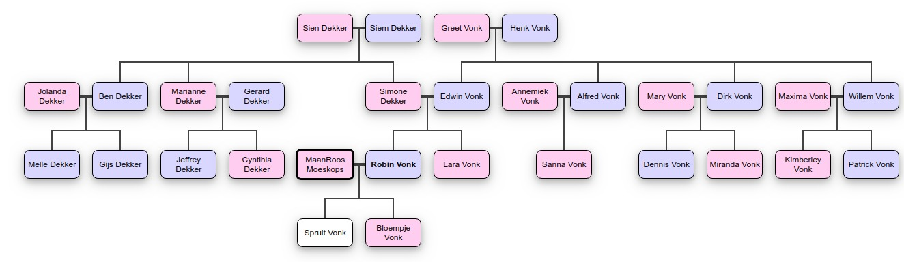

## Authors
Robin Vonk -- robinvonk789@gmail.com\
Michel Rummens -- michelrummens@gmail.com

# Expert Systems Example

## Example of how to query some rules.
More rules exist in our project, which are all called in the same manner.\
To execute more queries, please see our sourcecode.

Find all cousins of Robin Vonk.\
Returns: Nieces = [sanna_vonk, kimberly_vonk, miranda_vonk, cynthia_dekker].
```shell script
nieces_of(robin_vonk, Nieces).
```

Find all aunts of Robin Vonk. \
Returns: List = [marjanne_dekker].
```shell script
aunts_of(robin_vonk, Aunts).
```

Find first occurrence of an uncle of Robin Vonk. \
Returns: X = alfred_vonk 
```shell script
uncle_of(robin_vonk, Uncle).
```

Check if Lara Vonk is a brother of Robin Vonk. \
Returns: False
```shell script
brother_of(robin_vonk, lara_vonk).
```

Check if Lara Vonk is a sister of Robin Vonk. \
Returns: True
```shell script
sister_of(robin_vonk, lara_vonk).
```

Find all grandchildren of Henk Vonk. \
Returns: Grandchildren = [robin_vonk, lara_vonk, sanna_vonk, kimberly_vonk, patrick_vonk, dennis_vonk, miranda_vonk].
```shell script
grandchildren_of(henk_vonk, Grandchildren).
```
## Family tree

